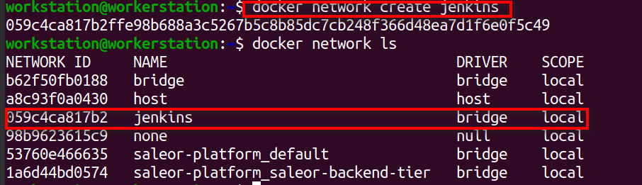
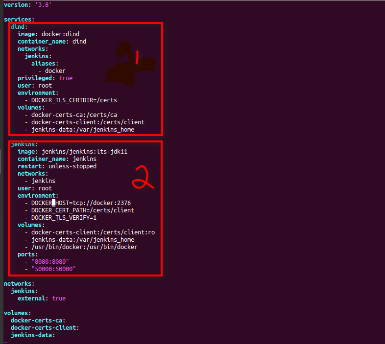
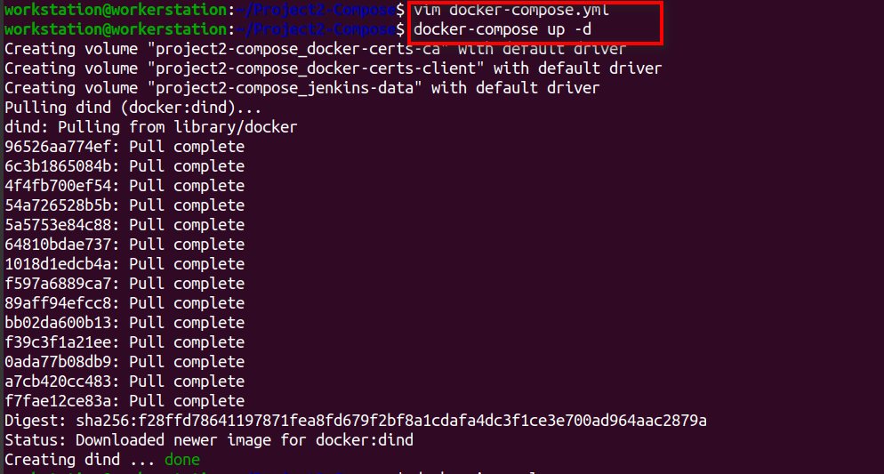
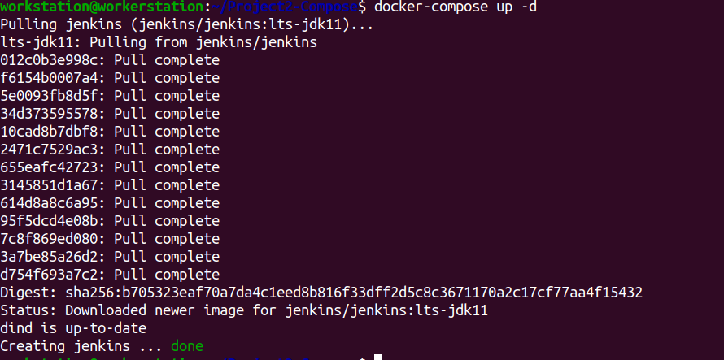
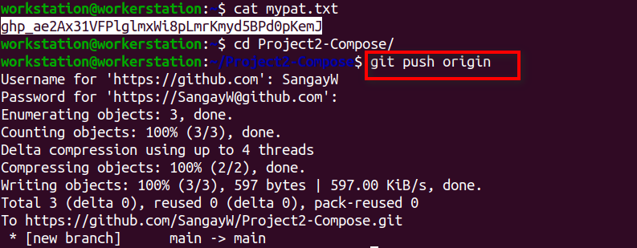
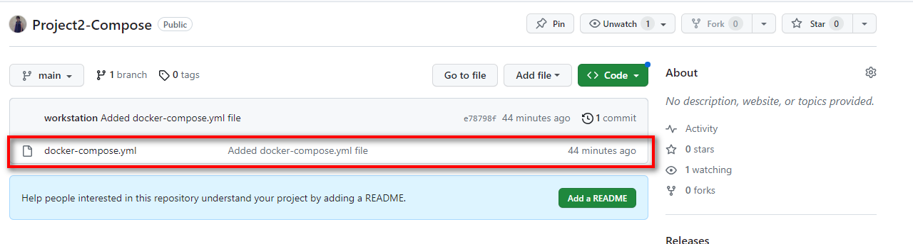

# Task2 Container and Jenkins Configuration

## Create a Docker Compose file/stack to run.

### Docker-In-Docker(DinD) Container

- Stands for Docker in Docker.

- Running Docker container inside another docker.

- Useful in running Docker commands in a CI/CD pipeline.

- It can be used to run Docker on the host which does not have Docker
  installed.

1.  Create docker network called Jenkins

Figure 1 Jenkins Network Creation

2.  docker-compose.yml file content having **dind** and **jenkins**
    services.

Figure 2 dind and Jenkins container creation

Figure 3 Running docker-compose file to create dind container

## Commit and push the Docker Compose file to the \`main\` branch of the \`Project2-Compose\` repository.

Figure 6 Using Personal Access Token to while pushing code to GitHub

Figure 7 docker-compose file in the Project2-Compose file in the GitHub.
